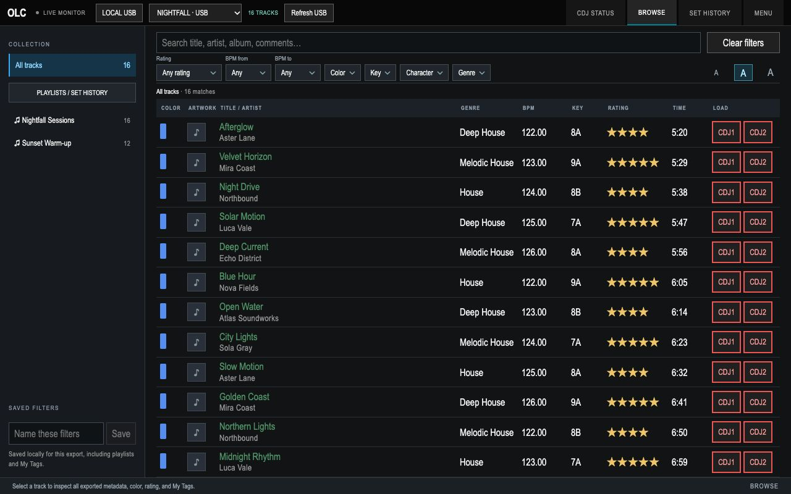
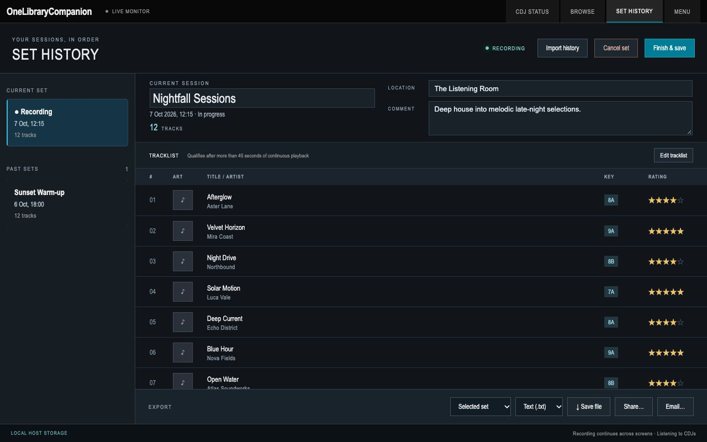

# OneLibraryCompanion (OLC)

Give your old CDJs a makeover! OneLibraryCompanion (OLC) reads Rekordbox One Library drives (from your CDJs or locally on your Mac/Raspberry Pi), shows your CDJ status in a modern user interface, remotely load tracks to your CDJs even if they don't support new formats (when the USB is mounted on the OLC host), navigates in your library at blazing speed, records your sets' tracklists, and more..

OLC runs on Mac or Raspberry Pi, alongside your players. You keep playback, cueing and mixing on the CDJs.

## Key features

- **Follow both decks:** live three-band waveforms, track overviews, BPM, pitch, key, master and sync status.
- **Plan transitions:** see beat and phrase structure, saved cues, loops and the countdown to the next hot cue when the export provides them.
- **Find your next track:** browse USB libraries and playlists; search, sort and combine BPM, key, genre, rating, color and My Tag filters. Save your favourite filter combinations.
- **Keep track of your selections:** harmonic-key highlighting helps find compatible tracks, and played-track marks help avoid repeats.
- **Load from your library:** send a track to a stopped CDJ from a CDJ-mounted USB or a OneLibrary USB connected to the Mac/Pi. Your original music stays unchanged.
- **Use more tracks on older CDJs:** built-in audio transcoding prepares supported files such as FLAC and ALAC as compatible WAV or AIFF when the destination needs it. No separate converter is required.
- **Record and reuse sets:** capture your tracklist, edit it, import supported rekordbox histories, revisit past sets as playlists, and export text, CSV or PDF.
- **Choose your setup:** use the standalone app or a browser on the same network, with mouse, keyboard or touch. Adjust the waveform display, visible filters and track-list size to suit you.

## CDJ status — follow the mix

Compare both decks at a glance and see how the tracks fit together. Zoom into the waveforms for the next transition, follow approaching cues and phrases, and switch between elapsed and remaining time. Open track information for artwork and fuller library details.

## Browse — find and load the next track in your OneLibrary

Explore playlists, narrow your choices with combined filters and save useful searches. Currently playing titles are bright green; previously played titles use softer green. Browse remembers your position when you return, and key highlighting helps with selection. Press **CDJ1** or **CDJ2** to load a stopped player; OLC blocks loads when the player is playing or unavailable.

For music attached to the Mac/Pi, both players can use different tracks from the same local USB library. When conversion is needed, OLC prepares the track before loading and shows progress. [Local USB and transcoding guide](docs/local-usb.md).

## Set history — keep and share your tracklist

Choose **Start set** before playing. OLC adds tracks after more than 45 seconds of continuous playback; choose **Finish & save** at the end. Name the set, add notes, edit its order and share a text, CSV or PDF tracklist. Reopen a saved set inside BROWSE to find those tracks in your connected library.

*Screenshots illustrate active sessions. CDJ status uses real exported waveform data; connection and playback states are illustrative.*

## Get started

[Download OLC](https://github.com/hdelplan/OneLibraryCompanion/releases) · [Installation guide](docs/distribution.md)

- **Mac:** Apple Silicon or Intel, macOS 13 or later.
- **Raspberry Pi 4 / 5:** Raspberry Pi OS Bookworm or later, 64-bit.

1. Install OLC and connect the computer and CDJs to the same network.
2. Set up the player connection in MENU and select a library in BROWSE. Local USB loading currently requires **Manual IP connections**; Mac also requires the included **Local USB Support** installation.
3. Keep OLC running and the USB attached while playing. To use another device, open the network address shown in MENU in its browser. No login or pairing is needed.

The interface uses a fixed 1280 × 800 layout scaled to the display. Downloads require access to this private repository.

## Know before a set

- **Paused non-master waveform tracking is limited.** Use the CDJ's display and audio for precise cueing. Temporarily making that player the tempo master can improve tracking.
- **One local USB library per connection session.** Stop both players and reconnect in OLC before switching local libraries.
- Physical Raspberry Pi, Intel Mac and minimum-OS testing is incomplete. Check [compatibility and operating limits](docs/compatibility.md) before relying on a setup.

## Help

[Using OLC](docs/screenshots.md) · [Display and filters](docs/configuration.md) · [Local USB and transcoding](docs/local-usb.md) · [Set history](docs/set-history.md)

For contributors: [Build guide](docs/development.md) · [Architecture](docs/architecture.md).

## License and acknowledgments

OLC is GPL-3.0-only and independent of Pioneer DJ, AlphaTheta and rekordbox. See [acknowledgments](THIRD_PARTY_NOTICES.md) and [source credits](third-party-licenses/SOURCE-CREDITS.md). Source and application packages include the applicable licenses.
