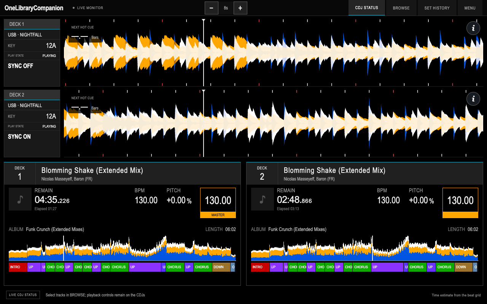
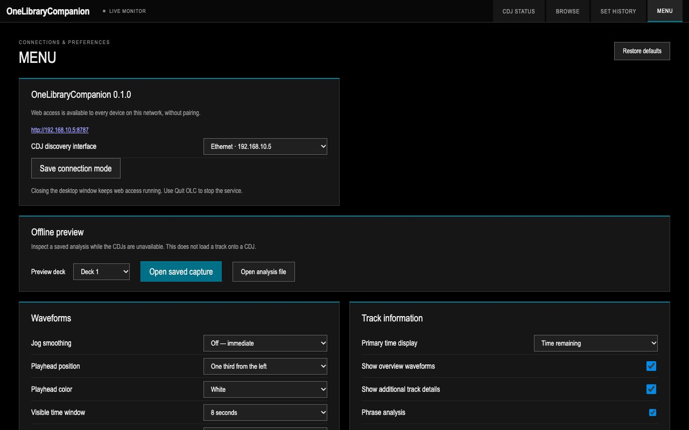
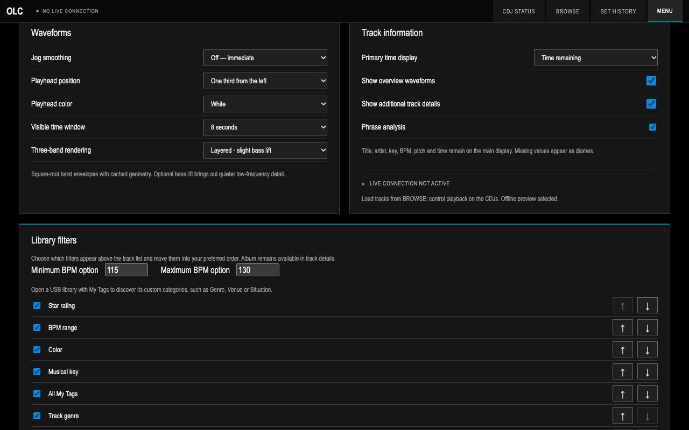
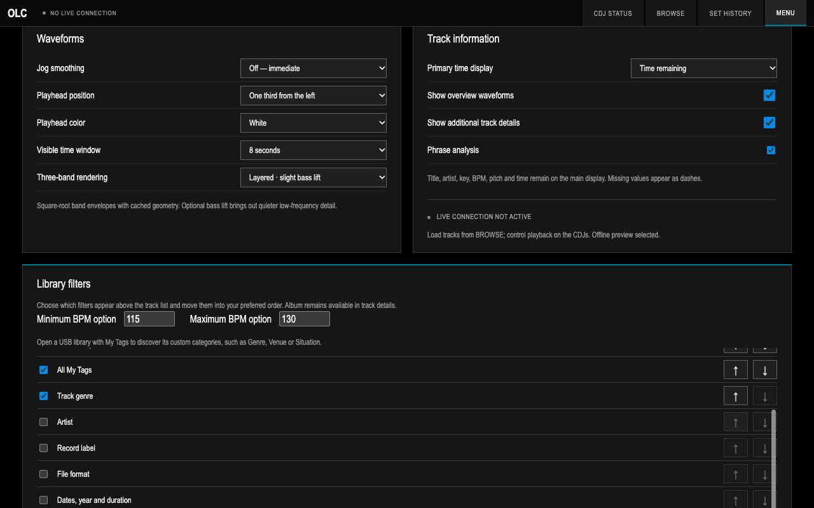

# Using OLC

OLC combines live monitoring, music selection and set recording. The screenshots show illustrative active sessions at 1280 × 800; track and connection data are simulated.

## CDJ Status — follow the mix

Use CDJ STATUS while performing to compare the two decks' timing and track structure. Scrolling three-band waveforms show approaching beats and cues; the whole-track overview and phrase sections help plan a transition. The next-hot-cue countdown expresses the distance in bars and beats. BPM, pitch, master and sync status reflect the connected players.

Use the zoom controls or a two-finger pinch to change the visible time window, tap the time display to switch elapsed/remaining time, and open the information button for fuller track metadata. OLC follows the players; transport and cue controls remain on the CDJs. Waveforms and phrase sections require the corresponding exported analysis.

## Browse — choose the next track

Choose a USB source, then explore playlists or select a past set using the PLAYLISTS / SET HISTORY toggle. Search and combine genre, color, rating, key, BPM and My Tag filters to narrow your choices. Column headings sort the results. Save useful combinations as named filters for that export.

Key highlighting helps identify compatible choices, while played-track highlighting shows tracks already recorded in the active set. Select a track to inspect its details; press CDJ1 or CDJ2 to load a stopped connected player. A disabled load button means the player, source or format does not meet the loading requirements. [Local USB loading](local-usb.md) also requires OLC to keep serving the drive during playback.

## Set History — keep a record and reuse it

Start a set before performing. OLC adds each track after more than 45 seconds of continuous qualifying playback, then saves the set when you choose Finish & save. Add a name, location and comment; edit the track order or remove entries before exporting a tracklist as text, CSV or PDF.

This archive is independent of the USB's history. Past sets can be selected inside BROWSE as playlists and matched against your connected library. Recording runs on the host even while another screen is open. [Set history guide](set-history.md).

## Menu — connect players and other devices

Choose Manual IP connections for explicit player addresses and local USB loading, or select a network interface for automatic discovery. Use the LAN addresses to open the same OLC host from another device. Offline preview lets you inspect an exported analysis file without loading a player.

## Menu — tailor the performance display

Choose the waveform window, playhead placement and color, motion smoothing and band emphasis to suit your viewing position. Select your preferred time display and show or hide the overview, phrase sections and additional details. Preferences are saved on the device where you change them.

## Menu — tailor music selection

Choose which filters appear in BROWSE and arrange them in the order you use them. Set the BPM options and include custom My Tag categories from the selected export. These choices affect how you find music; they do not change the USB or rekordbox library.

